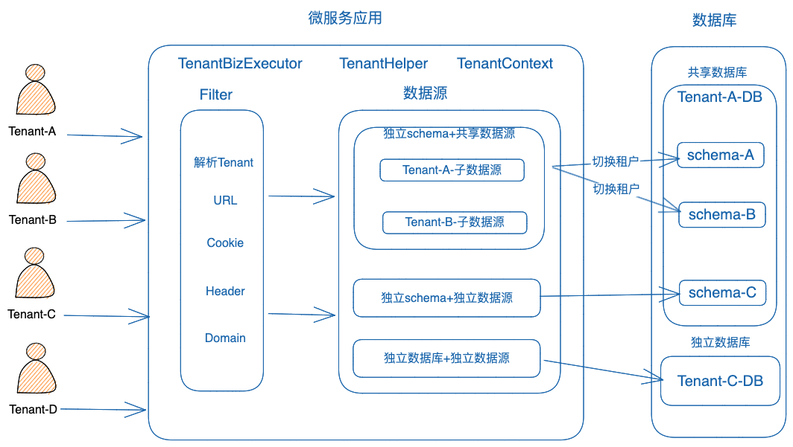

## 简介

`multi-tenancy-datasource-spring-boot-starter` 是一个基于`springboot`的多租户的开发神器. 包含了多租户场景下业务封装和组件抽象。

## 特性

- 数据库隔离模型: 基于`Postgresql`的 `schema`，`database` 级别隔离
- Redis隔离模型: 为每个key增加租户前缀
- 租户标识解析: 从`Cookie`, `Header`, `Domain`,`URL Path`,`Env`中解析租户标识
- 租户标识传播: 支持`Seata`, `Feign`, `RestTemplate`
- 数据源: 多个租户复用数据库`Connection`减少资源消耗,也可使用独立数据源
- 租户业务执行器: 设置和释放当前线程的租户上下文
- 动态注册租户: 基于`Redis Stream`在运行期注册租户
- baseline jdk17. support Graalvm.
- `postgresql` 中表DDL对比和模版`Schema`，方便新增租户和查看其差异
- 扩展cola组件，抽象租户定制化配置类`TenantCustomization`，租户动态脚本引擎`.TenantDynamicScriptExecutor`满足定制化业务逻辑的开发。

## Redis

- 为每个租户增加不同的key前缀来做数据隔离

## DB



## 使用方式

- Maven

```
<dependency>
    <groupId>cc.sofast.infrastructure</groupId>
    <artifactId>multi-tenancy-datasource-spring-boot-starter</artifactId>
    <version>{lastverion}</version>
</dependency>
```

- Gradle

```
implementation 'cc.sofast.infrastructure:multi-tenancy-datasource-spring-boot-starter:{lastverion}'
```

- jdk17 启动时需要的参数

```
--add-opens java.base/java.lang=ALL-UNNAMED --add-opens java.base/java.lang.invoke=ALL-UNNAMED --add-opens java.base/java.util=ALL-UNNAMED --add-opens java.base/java.lang.reflect=ALL-UNNAMED --add-opens java.base/java.text=ALL-UNNAMED --add-opens java.desktop/java.awt.font=ALL-UNNAMED --add-opens java.base/java.nio=ALL-UNNAMED
```